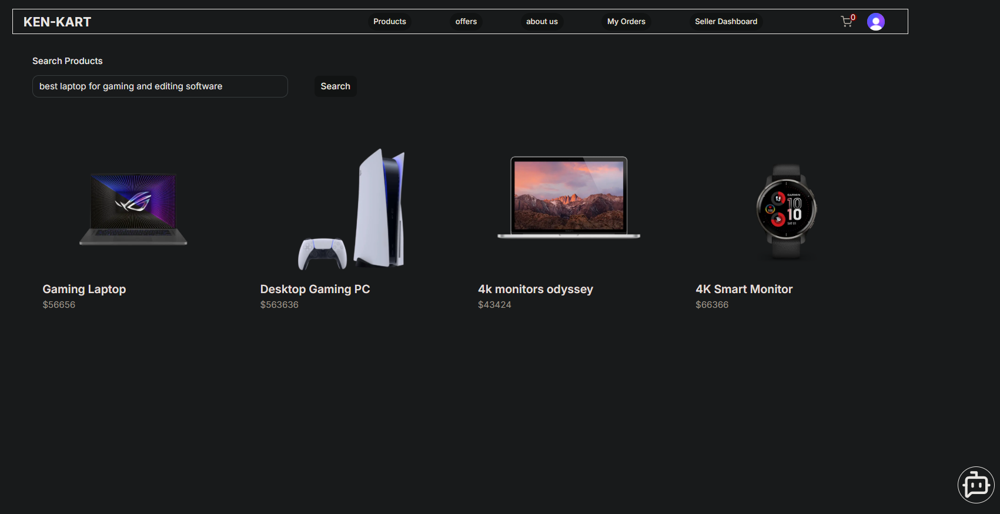
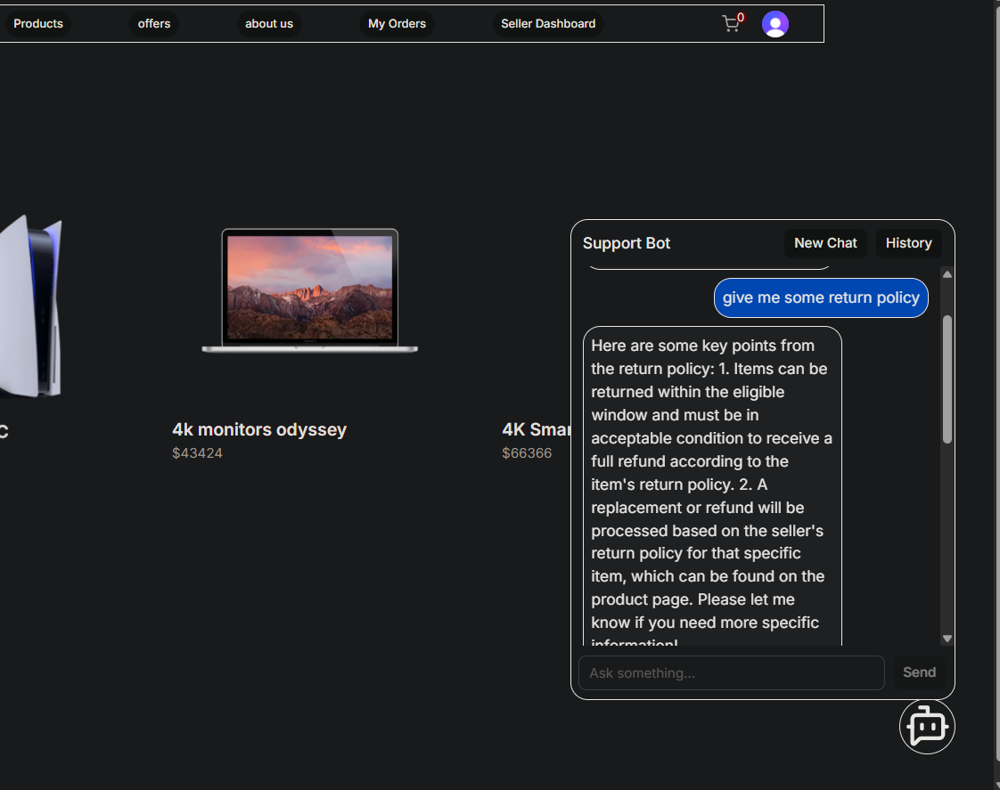
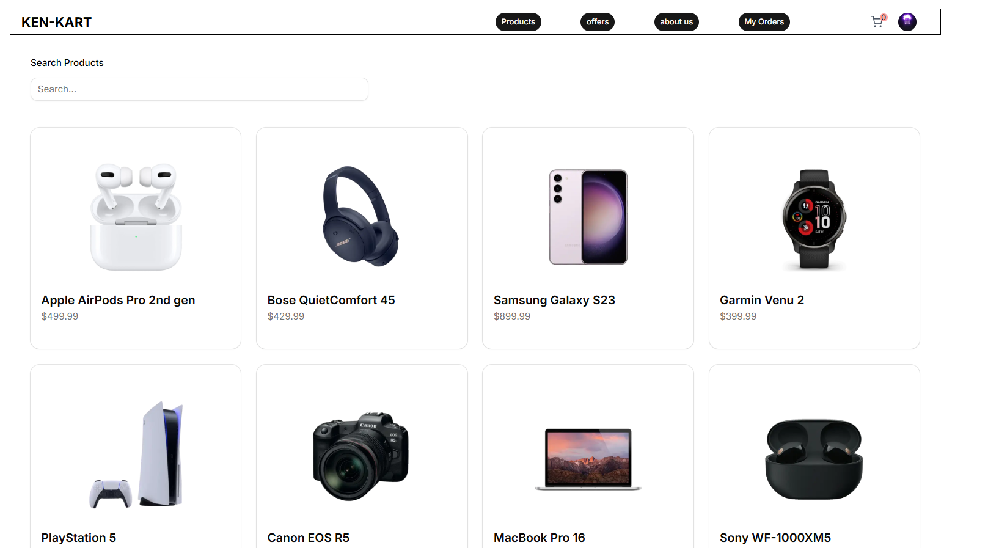
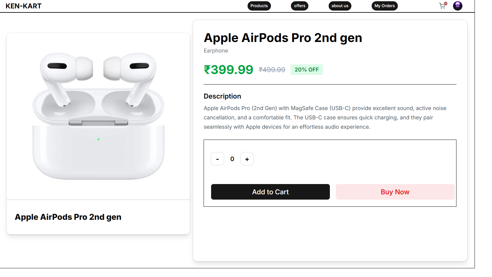
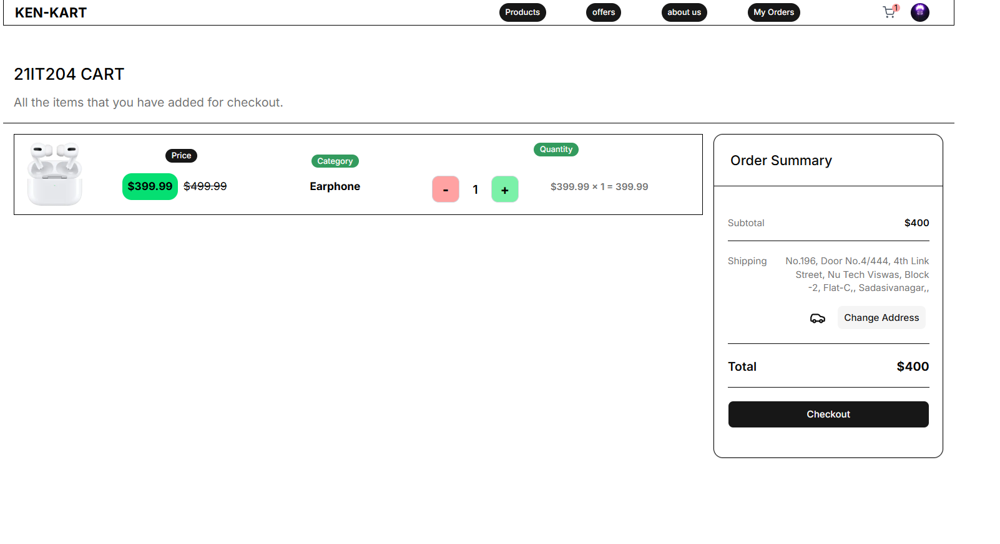
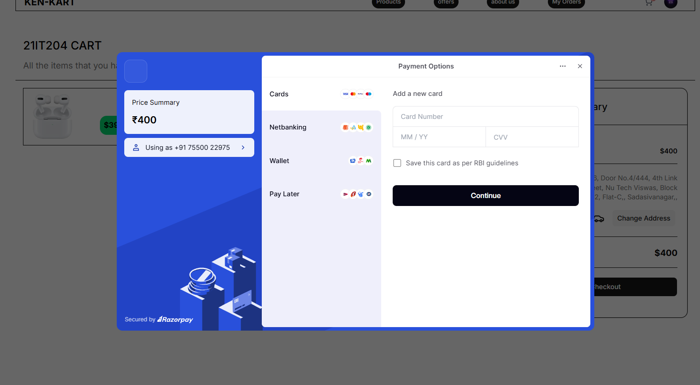
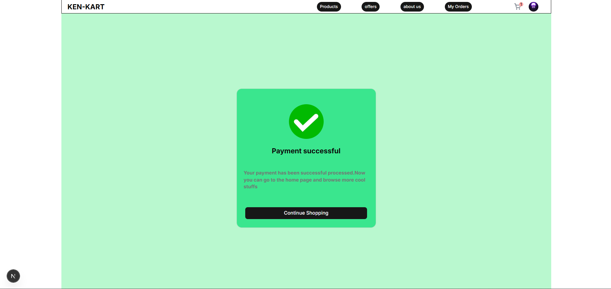
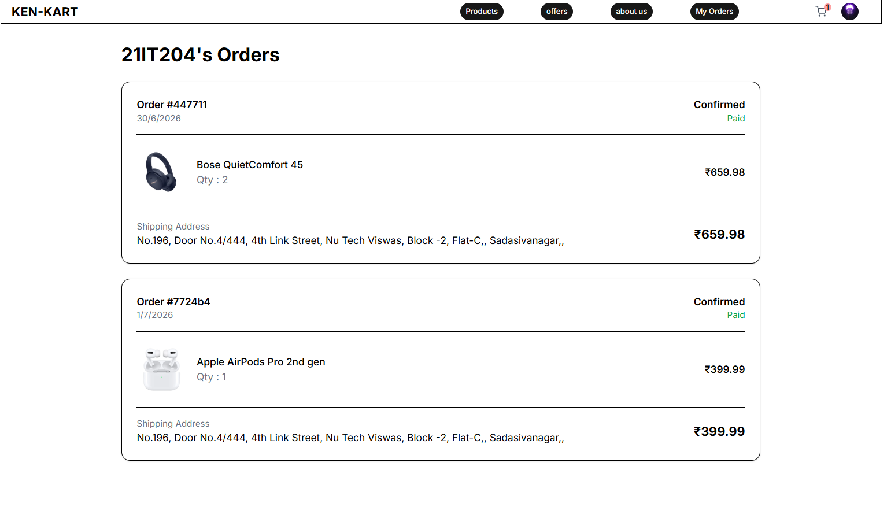

# KenKart AI-Powered E-Commerce Platform 🛒🤖

Welcome to **KenKart** (also known as **AIKart**), a state-of-the-art, premium, role-based e-commerce platform. KenKart integrates modern full-stack web technologies with advanced AI features, including **Semantic Product Search** and a **RAG-based AI Shopping Assistant**.

The project is split into a **Next.js Frontend** and a **FastAPI + ChromaDB Backend** to deliver a responsive, intelligent, and scalable shopping experience.

---

## 📁 Repository Structure

```text
aikart/ (Root Directory)
├── ken-kart-/            # Frontend (Next.js, Tailwind CSS, MongoDB, Clerk, Razorpay)
│   ├── app/              # Next.js App Router (Pages, APIs, context syncing)
│   ├── components/       # Custom React & shadcn/ui components
│   ├── context/          # React Context (Auth, Cart, User state)
│   ├── public/           # Static assets (including readme showcase images)
│   └── ...
└── backend/              # AI Backend (FastAPI, ChromaDB, Sentence Transformers, LangChain)
    ├── db/               # ChromaDB client initialization
    ├── assets/           # Source documents for ingestion
    ├── main.py           # FastAPI endpoints (Embeddings & Chat/RAG)
    ├── ingestdoc.py      # Document ingestion and chunking script
    └── ...
```

---

## 📸 AI Features Showcase

### 🔍 Semantic Product Search
Unlike traditional keyword searching, KenKart uses semantic embeddings generated by `all-MiniLM-L6-v2` to understand the user's search intent. It matches search terms conceptually with products stored in ChromaDB.

<p align="center">
  
</p>

### 💬 RAG (Retrieval-Augmented Generation) Shopping Assistant
An intelligent conversational assistant powered by LangChain and OpenAI (`gpt-4o-mini`). It retrieves relevant context from ChromaDB (`ragcollection`) populated with store guides and policies to provide accurate, context-aware answers to user inquiries while preserving chat history.

<p align="center">
  
</p>

---

## 📸 Entire Platform Showcase (Storefront & Portals)

### User Interface & Storefront
<p align="center">
  
  
</p>

<p align="center">
  
  
</p>

<p align="center">
  
  
</p>

### Role-Based Portals
<p align="center">
  
  
</p>

---

## 🛠️ Architecture & Tech Stack

### 💻 Frontend (`ken-kart-`)
- **Framework**: Next.js 16 (App Router) & React 19 with TypeScript
- **Styling**: Tailwind CSS v4 & shadcn/ui primitives
- **Database**: MongoDB via Mongoose ORM
- **Authentication**: Clerk Next.js SDK
- **Payment Gateway**: Razorpay Checkout API
- **Image Storage**: Cloudinary SDK (for seller product uploads)

### 🤖 AI Backend (`backend`)
- **Server Framework**: FastAPI
- **Vector Database**: ChromaDB (Persistent storage client)
- **Embedding Model**: Sentence Transformers (`all-MiniLM-L6-v2`) running locally
- **Orchestration**: LangChain Core
- **LLM Provider**: OpenAI Chat API (`gpt-4o-mini`)
- **Data Splitting**: LangChain's `RecursiveCharacterTextSplitter`

---

## 🚀 Setup & Installation

### 1. Clone & Root Directory
Ensure you are in the project root:
```bash
git clone <repository-url>
cd aikart
```

---

### 2. Setting Up the AI Backend (`backend`)

#### Prerequisites
- Python 3.10+ installed
- OpenAI API Key

#### Installation Steps
1. Navigate to the backend directory:
   ```bash
   cd backend
   ```
2. Create and activate a virtual environment:
   ```bash
   python -m venv .venv
   # On Windows (PowerShell):
   .venv\Scripts\Activate.ps1
   # On macOS/Linux:
   source .venv/bin/activate
   ```
3. Install dependencies:
   ```bash
   pip install -r requirements.txt
   # OR if using uv:
   uv pip install -r pyproject.toml
   ```
4. Create a `.env` file in the `backend/` directory:
   ```env
   OPENAI_API_KEY=your_openai_api_key_here
   ```
5. Ingest help/documentation files into the Vector Store (ChromaDB):
   Ensure your `.txt` documents are inside `backend/assets/`, then run:
   ```bash
   python ingestdoc.py
   ```
6. Start the FastAPI development server:
   ```bash
   fastapi dev main.py
   # The backend will run on http://localhost:8000
   ```

---

### 3. Setting Up the Next.js Frontend (`ken-kart-`)

#### Prerequisites
- Node.js (v18.x or later)
- MongoDB running locally or MongoDB Atlas URI
- Clerk, Razorpay, and Cloudinary accounts

#### Installation Steps
1. Navigate to the frontend directory:
   ```bash
   cd ../ken-kart-
   ```
2. Install package dependencies:
   ```bash
   npm install
   ```
3. Create a `.env` file in the `ken-kart-/` directory:
   ```env
   # Clerk Authentication
   NEXT_PUBLIC_CLERK_PUBLISHABLE_KEY=your_clerk_publishable_key
   CLERK_SECRET_KEY=your_clerk_secret_key

   # Database Connectivity
   MONGO_URI=mongodb://localhost:27017/kenkart

   # Razorpay Credentials (Test keys recommended for development)
   TEST_API_KEY=your_razorpay_key_id
   TEST_KEY_SECRET=your_razorpay_key_secret
   NEXT_PUBLIC_RAZORPAY_KEY=your_razorpay_key_id

   # Cloudinary Storage Configuration
   CLOUDINARY_CLOUD_NAME=your_cloudinary_cloud_name
   CLOUDINARY_API_KEY=your_cloudinary_api_key
   CLOUDINARY_API_SECRET=your_cloudinary_api_secret
   ```
4. Start the Next.js development server:
   ```bash
   npm run dev
   # The frontend will run on http://localhost:3000
   ```

---

## 🔒 Key Integrations & Core Flows

### 🔄 Live MongoDB Synchronization
Upon user authentication via Clerk, `UserContext` automatically issues a post request to `/api/user/syncuser`. The handler validates the session, matches/creates the MongoDB User record, and assigns corresponding platform permissions (Admin, Seller, or Buyer).

### 💳 Razorpay Payments
- **Order Instantiation**: Done on the server side to verify cart amounts against the database.
- **Client Checkout**: Triggers the Razorpay checkout overlay.
- **Verification**: Signature confirmation is verified on the backend using HMAC-SHA256 before capturing or updating order status.

### 🤖 Semantic Search & Chat RAG Flow
1. When a seller uploads/adds a product, the frontend triggers the backend `/add_product_embedding` endpoint to register the item text vector in ChromaDB.
2. During searches, `/search_product_embedding` finds product ID correlations.
3. During support chats, `/chat` uses ChromaDB's `ragcollection` to find matching system guidance paragraphs, appends user conversation history, and invokes OpenAI `gpt-4o-mini` to formulate responses.
